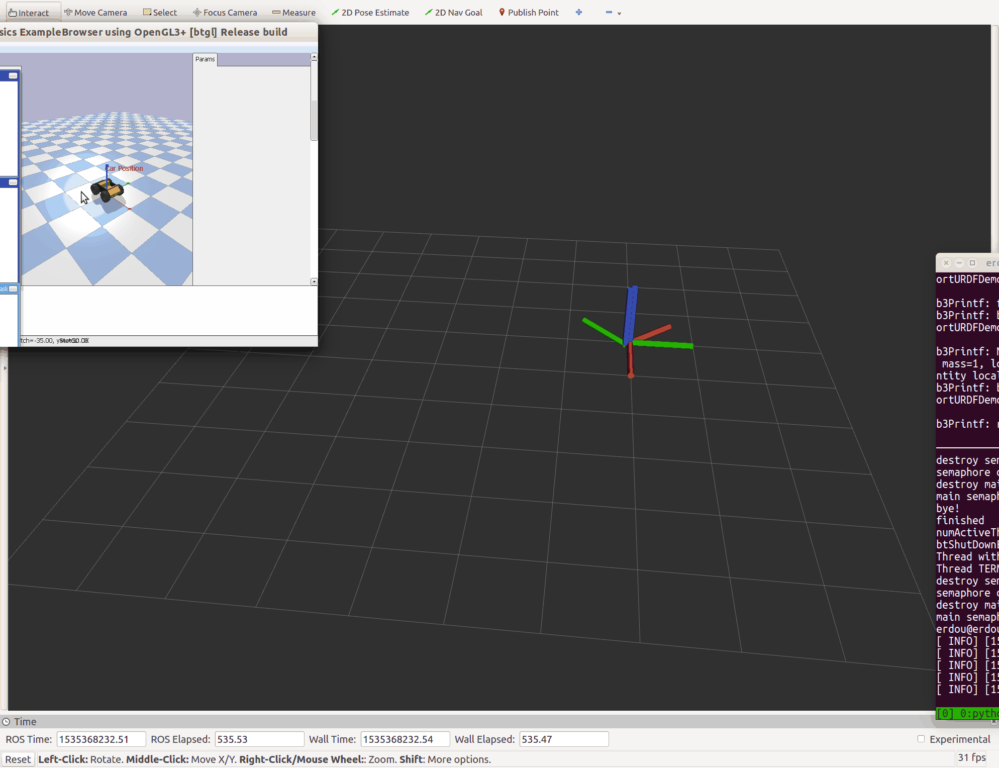
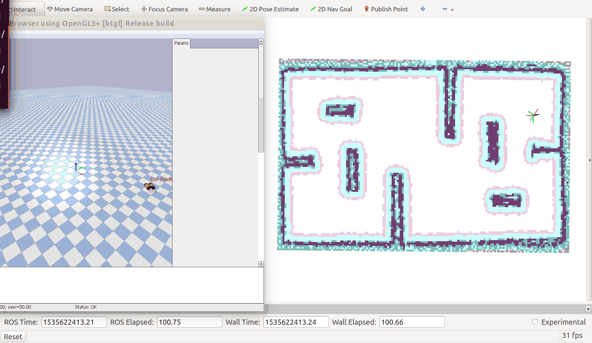
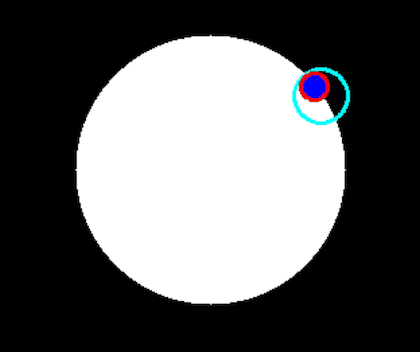
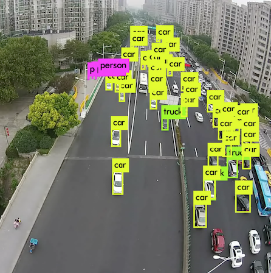

# navigation-learning
## Dependencies
* Ubuntu 16.04
* [ROS Kinetic](http://wiki.ros.org/kinetic/Installation/Ubuntu)
* Pybullet
* Python2.7
* Google Protobuf
* ROS [move_base](http://wiki.ros.org/move_base) package ([GitHub](https://github.com/ros-planning/navigation))
* OpenCV 3.4
* Eigen3


```bash
sudo apt-get install protobuf-compiler libprotobuf-dev cmake libeigen3-dev
sudo pip2 install pybullet numpy
```
## Effect
### Simple PID Controller



### Move Base



### Kalman Filter



### YOLO
[](https://box.nju.edu.cn/seafhttp/files/ae8bbe4d-53f5-4b50-a8d1-ba46e64adaa7/RSD-005-13min-res-darknet.mp4 "Click to watch the YOLO video")